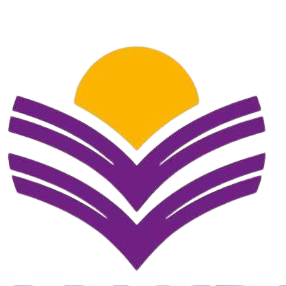

<!DOCTYPE html>
<html lang="en" >
<head>
  <meta charset="UTF-8" />
  <meta name="viewport" content="width=device-width, initial-scale=1" />
  <title>Aathithya | Cybersecurity Portfolio</title>
  
</head>
<body>
  <nav>
    <a href="#skills">Skills</a>
    <a href="#education">Education</a>
    <a href="#projects">Projects</a>
    <a href="#contact">Contact</a>
  </nav>

  

    <section class="hero" id="hero">
      

          
      

      

        <h1>Aathithya Shanmuga Sundaram</h1>
        
Cybersecurity Student & Ethical Hacker

      

    </section>

    <section id="skills">
      <h2>Skills & Tools</h2>
      

        

          
Google Dorks

          

            

          

        

        

          
curl

          

            

          

        

        

          
WPScan

          

            

          

        

        

          
Nikto

          

            

          

        

        

          
OWASP ZAP

          

            

          

        

        

          
securityheaders.com

          

            

          

        

      

    </section>

    <section id="education">
      <h2>Education</h2>
      

        

          
          

            
Sri Ramakrishna College of Arts & Science

            
B.Sc. Computer Science (Cybersecurity)

            
2023 - Present

          

        

        

          
          

            
MotherLaand Matriculation higher Secondary School

            
Higher Secondary Education

            
2022 - 2023

          

        

      

    </section>

    <section id="projects">
      <h2>Responsible Disclosures & Reports</h2>
      

        

          <h3>Public Exposure of Personally Identifiable Information</h3>
          
Identified sensitive endpoint exposure risking student data.

          
<a href="#" target="_blank">View Report</a>

        

        

          <h3>Private WordPress Site RCE</h3>
          
Discovered high severity RCE vulnerability via outdated plugin.

          
<a href="#" target="_blank">View Report</a>

        

        

          <h3>SQL Injection in Feedback System of Educational Institution</h3>
          
Found missing security headers increasing injection risk.

          
<a href="#" target="_blank">View Report</a>

        

      

    </section>

    <section id="contact">
      <h2>Contact Me</h2>
      

        <a href="mailto:aathithyaacharya@outlook.com">Email</a>
        <a href="https://www.linkedin.com/in/aathithya-shanmuga-sundaram/" target="_blank">LinkedIn</a>
        <a href="https://github.com/Aathithya-Shanmuga-Sundaram" target="_blank">GitHub</a>
      

    </section>
  

  
</body>
</html>
